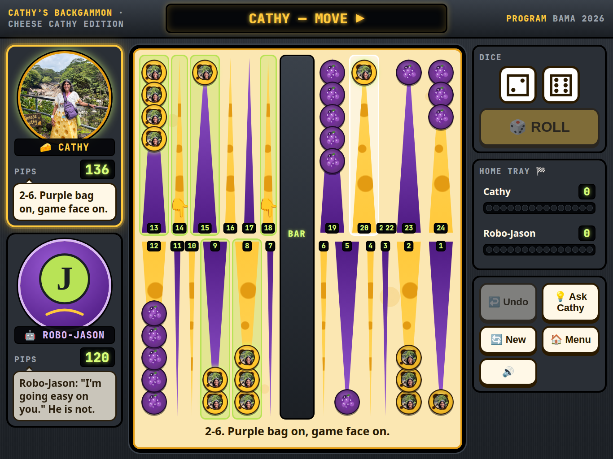

# Cathy's Backgammon 🧀

The **Cheese Cathy Edition** — a big, friendly backgammon console built for an
**iPad held sideways**. Huge touch targets, big readable type, glowing legal moves,
fat Swiss-hole cheese checkers vs grape checkers. No tiny chrome, no squinting.



## Play on iPad (Safari) — hold it sideways

The game is laid out like a gym-bike console: the **board fills the middle**
(~60% of the screen), Cathy and Jason live on the **left rail**, the fat **dice /
ROLL** and the keypad live on the **right rail**. Nothing scrolls, nothing zooms.

1. **Turn the iPad to landscape** (long edge down). Portrait still works — the
   board stacks on top of the console — but landscape is the real thing.
2. Open the GitHub Pages link in **Safari**.
3. **Add to Home Screen** for the full-screen console:
   - Tap **Share** (the box with the arrow) → **Add to Home Screen** → **Add**.
   - Launch it from the home-screen icon (Cathy's cheese checker). It runs
     **full screen** — no Safari bars — and **offline** after the first visit.
4. If the iPad has a rotation lock on, swipe down from the top-right corner and
   tap the lock icon so the screen can turn.

Tips for Mom:
- The **whole point** (the long triangle) is the tap target, not just the checker.
- Tap the **dice** or the big **ROLL** button — both roll.
- **Ask Cathy** lights up the move she'd make. **Undo** takes the last one back.
- If the board ever looks squished, rotate the iPad once; it re-fits itself.
- **Sound**: the dice tumble, checkers knock, hits go *BONK*, and there's a fanfare when you
  win. iPad only allows audio after you tap something, so **the first tap on ROLL wakes it up**
  (nothing to grant, no popup). The **🔊 Sound on** key on the right rail mutes everything;
  tap it again to turn it back on. If the iPad's side switch / Control Center is on silent,
  the game is silent too.

## How to play (30 seconds)

- You are the **cheese checkers** 🧀 — the ones with your face on them. Tap **ROLL** (or the dice).
- Tap a **glowing** checker, then tap a glowing landing spot (👇).
- Land alone on a lone grape checker to **hit it to the bar** (the hound comes out 🐾).
- Checkers on the middle **BAR** must come back in first.
- Get all 15 home, then tap the **HOME TRAY** to bear them **OFF** 🏁. First one out wins!
- Rolling **doubles = 4 moves** 🎉.
- Stuck? **💡 Ask Cathy** — she'll tell you what she'd do. Mis-tap? **↩️ Undo**.

Modes: **Play Robo-Jason** (gentle AI that talks back) and
**Cathy vs Jason** pass-and-play hotseat.

## Publish with GitHub Pages

Static site, no build step. From the repo root:

1. Repo **Settings → Pages** → *Deploy from a branch*.
2. Branch: `main`, folder: `/ (root)`. Save.
3. The `.nojekyll` file is already committed, so `assets/` and `sw.js`
   are served as-is.

## The three photos (and where Cathy shows up DURING play)

- **HUD avatar** (left console, every turn): Cheese Cathy costume crop. Swaps to the
  **mom-dog** crop for 3.5 s whenever she hits Jason ("RELEASE THE HOUND!"), and to
  **Bama 2026 "I made it!"** when she bears off her first checker or gets all 15 home.
- **Checkers**: hi-res cheese discs with **her face** in the middle (hound face during a
  hit, Bama face while bearing off). Jason's are grape discs.
- **Home tray**: 15 cheese-disc slots fill as she bears off.
- **Title**: Cheese Cathy hero + two polaroids. **Win**: Bama photo (or the hound if Jason wins).

Files: `assets/photos/*.png` (originals, committed), `assets/photos/derived/*-face.jpg`
(face crops for checkers), `assets/chatgpt-art/*` (HUD avatars + checker discs).
Illustrated `.svg` fallbacks load only if a PNG is missing.

## For developers

```
node smoke.mjs            # rules tests + 5 seeded AI-vs-AI full games
python3 -m http.server    # serve locally, then open index.html
```

In-browser smoke (scripted taps, a live timed Robo-Jason turn, full game; fails loudly on JS errors):

```
http://localhost:8000/index.html?shot=smoke&seed=2026   # expect SMOKE-OK
```

Screenshot helpers (render at iPad landscape sizes: 1024×768, 1180×820, 1194×834, 1366×1024):

```
?shot=title   # title screen        ?shot=mid&seed=2026   # Cathy mid-move, banter
?shot=hit     # hound-swap moment    ?shot=win             # win screen
```

`screenshots/` holds the four 1024×768 shots the manifest points at plus
`ipad-<w>x<h>-*.png` at the other iPad sizes and one portrait (768×1024) fallback.

### Layout notes (landscape console)

- `#screen-game` is `position: fixed; height: 100dvh` with `grid-template-rows: auto 1fr`
  — a thin LED header, then `.game-main`, a 3-column grid
  `[--rail-l] [minmax(0,1fr)] [--rail-r]`. Rails are `clamp()` widths so the board keeps
  ~59% of the width on every iPad; nothing in the console can scroll the page.
- Checker diameter is a CSS variable (`--ck`). `app.js` `fitBoardNow()` measures a point and
  sets `--ck` so checkers fill the point width and five always stack in a half-board;
  the BAR column is `--ck + 14px`. A `ResizeObserver` re-fits on rotate / resize.
- The home tray picks a 5×3, 8×2 or 15×1 grid (`--cols`, `--slot`) to fill whatever
  height is left between the dice and the keypad.
- Dice are `aspect-ratio: 1` and fill the rail two-across (2×2 on doubles); pips are CSS
  radial-gradients keyed off `data-v`, so they scale with the die.
- `viewport-fit=cover` + `env(safe-area-inset-*)` padding, `apple-mobile-web-app-capable`,
  `touch-action: none` on the console and a `touchmove` guard stop pinch/rubber-band.
- Portrait (`orientation: portrait`) stacks board over `[players | console]`;
  phones (≤640px) fall back to a scrolling single column.

### Sound (`sfx.js`)

All sound is **synthesized in WebAudio** — no audio files, nothing extra to cache, works
offline. `window.CathySfx` exposes one function per moment: `roll` (dice tumble + two clacks),
`doubles` (4-note arcade riff), `dance` (no-move womp), `pickup` / `place` / `stack` (checker
chirp / knock / knock+tick), `enter` (whoosh in from the bar), `hit` (kick thump + smack +
cartoon boing), `off` (tray coin chime), `cheese` (tiny brass fanfare: first bear-off, all home),
`win` / `lose` (arpeggio + chord / sad trombone), `tap` (console key), `bad` (buzzer).
Everything runs through one gain → compressor bus so stacked hits don't clip the iPad speaker.

- The `AudioContext` is created lazily on the **first sound, which is always a user tap**
  (ROLL, a checker, a key) — that satisfies iOS's gesture rule with no prompt. A
  `pointerdown` listener also resumes the context if iOS suspended it in the background.
- `setMuted(true)` makes every call a no-op; `app.js` wires that to the **🔊 Sound on** key.
- Headless Chrome / the `?shot=smoke` run never touches audio hardware: with no gesture the
  context just stays suspended and every call is a silent no-op.

### Voice lines

Banter lives in the `V` table in `app.js`, one array per moment (`cathyRoll`, `cathyHit`,
`jasonGotHit`, `hint`, …). `pick()` never returns the same line from the same list twice in a
row. `Ask Cathy` fills `{why}` from `hintWhy()` (hit / bear off / bar / makes a point / safe /
race) so the joke still carries a real reason.

Files: `engine.js` (rules, no deps, browser+node), `ai.js` (soft 1-ply AI), `sfx.js` (WebAudio
sound kit), `app.js` (UI, voice lines, presence, flow, console fit), `styles.css` (console skin
+ grid), `sw.js` (offline cache), `manifest.webmanifest` (Add to Home Screen; PNG icons in
`assets/`), `screenshots/`.
